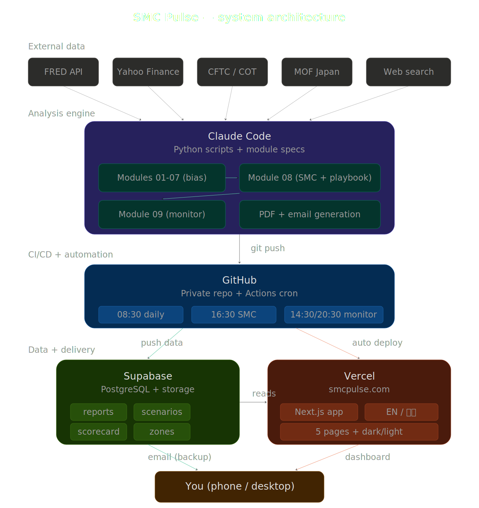

# SMC Pulse

**Smart Money Concepts analysis for USD/JPY intraday trading.**

Website: [smcpulse.com](https://smcpulse.com) | Built with [Claude Code](https://claude.ai/code)

## What It Does

Three questions the system answers each trading day:

1. **Should I be long or short?** — Modules 01-07 aggregate macro, technical, positioning, and cross-asset signals into a weighted directional bias. Technicals drive the score (±3); macro and cross-asset provide context (±1 each).
2. **Where do I enter?** — Module 08 identifies Smart Money Concepts (order blocks, FVGs, liquidity levels) across 4 timeframes and outputs a graded entry plan with ATR-based stops and position sizing.
3. **What are the realistic paths?** — The 12h Playbook projects 3 probability-weighted price scenarios with distance-based intervention risk modeling.

The system also knows when to say **no trade** — if the best zone is too far away and there's no session catalyst, it outputs "NO SETUP" instead of forcing an entry.

## Architecture



External data flows through Python analysis modules, gets pushed to Supabase (data) and served via Vercel (dashboard) for delivery. Scheduling is handled by local cron.

### Modules

| # | Module | Frequency | Data Source | Purpose |
|---|--------|-----------|-------------|---------|
| 01 | Macro Regime | Daily | FRED, MOF Japan | US/JP rate differential, JGB curve, DXY |
| 02 | Policy & Politics | Weekly | Web search | BOJ/Fed stances, intervention risk, political developments |
| 03 | Technicals | Daily | Yahoo Finance | SMA, RSI, MACD, Ichimoku |
| 04 | Positioning | Weekly | CFTC | COT net speculative position, crowding signal |
| 05 | Cross-Asset | Daily | FRED, Yahoo | Correlations (Nikkei, Gold, VIX, Oil), energy risk |
| 06 | Seasonality | Weekly | Reference data | Seasonal bias, flow events, trade balance |
| 07 | Checklist | Daily | Modules 01-06 | Intraday-weighted signal aggregation → direction + confidence |
| 08 | SMC Entry | On-demand | Yahoo Finance | Order blocks, FVGs, entry zones, 12h playbook |
| 09 | Scenario Monitor | Auto | Yahoo Finance | Live check + scorecard |

### Scoring System

Module 07 uses **intraday-weighted scoring** — technicals are the primary driver:

| Module | Weight | Rationale |
|--------|--------|-----------|
| Technicals (03) | ±3 (HIGH=3, MED=2, LOW=1) | Primary driver for intraday entries |
| Macro (01) | ±1 | Background context, changes weekly |
| Cross-Asset (05) | ±1 | Regime context |
| Policy (02) | ±1 | Weekly background |
| COT (04) | ±1 | Contrarian flag |
| Seasonality (06) | ±1 | Monthly context |

Daily max: **±5**. Full weekly max: **±8**. Daily conviction is scored independently — missing weekly modules don't cap conviction.

### Risk Management

Module 08 includes integrated risk management:

| Feature | How It Works |
|---------|-------------|
| **ATR-based stops** | `max(ATR_1H × 0.5, 5 pips)` — adapts to session volatility |
| **Position sizing** | Lots computed from account size × risk% × grade scaling factor |
| **Grade scaling** | A: 100% risk, B: 50%, C: 25%, D: 0% (paper trade) |
| **No-trade filter** | Zone >30 pips away + no catalyst → NO SETUP |
| **Kill switch** | FOMC/BOJ decision days suppress entries |
| **Intervention probability** | Distance-based: <158 → 1%, 158-160 → 3-8%, 160-162 → 10-20%, >162 → 25% |

### Confluence Grading

| Grade | Score | Action |
|-------|-------|--------|
| A | ≥5.0 | Full size entry |
| B | ≥3.0 | Half size entry |
| C | ≥2.0 | Quarter size (caution) |
| D | ≥1.0 | Paper trade only |
| NO SETUP | <1.0 | No entry |

### Validation

Every report is cross-checked against 3+ external sources within 3 minutes of generation:

| Source | Indicators | Method |
|--------|-----------|--------|
| Yahoo Finance | Spot, SMA, RSI, MACD, Ichimoku, US 10Y, correlations | API + computed |
| Investing.com | RSI, SMA, MACD, JP 10Y yield | Web scrape (3-retry) |
| TradingView | Spot, RSI, SMA, MACD, Ichimoku | Scanner API |
| Derived | Rate spread (US 10Y - JP 10Y) | Computed cross-source |

16 indicators validated, 0 SKIPs. Results pushed to Supabase and displayed on [smcpulse.com/validation](https://smcpulse.com/validation).

### Terminology

- **Setup** (A/B/C/D) = market condition classification. A: Intervention Bounce, B: Trend Retracement, C: Liquidity Sweep, D: Tokyo Fix Fade.
- **Scenario** (Primary/Alternative/Tail Risk) = forward-looking playbook projections with probability weights.

## Web Dashboard

Live at [smcpulse.com](https://smcpulse.com)

| Page | Purpose |
|------|---------|
| Dashboard | Hero card, MTF alignment, risk alerts, liquidity levels |
| Reports | Daily + weekly modules with charts (date navigation) |
| SMC Analysis | Entry plan, 12h playbook, scenario paths, active zones |
| Scorecard | Module 09 accuracy tracking |
| Validation | Cross-reference results by module with PASS/WARN/FAIL/SKIP counts |
| Journal | Trade log with report context and performance stats |

Features: auto dark/light theme, English + Traditional Chinese, mobile-responsive, real-time data from Supabase.

### Infrastructure

| Service | Role |
|---------|------|
| Supabase | PostgreSQL database + file storage (Tokyo region) |
| Vercel | Next.js hosting + CLI deploy |
| Local cron | Scheduled report generation + Supabase push |

## Commands

| Command | Description |
|---------|-------------|
| `/usdjpy-daily` | Full daily analysis (Modules 01, 03, 05, 07) |
| `/usdjpy-weekly` | Full weekly analysis (all Modules 01-07) |
| `/usdjpy-entry` | Module 08 SMC entry zones + 12h playbook + chart |
| `/usdjpy-levels` | Quick reference: active zones and liquidity levels only |
| `/usdjpy-fix` | Tokyo Fix Fade check (best at 09:50 JST) |
| `/usdjpy-check` | Pre-trade checklist from cached data (no API calls) |
| `/usdjpy-cot` | Standalone CFTC COT positioning analysis |
| `/usdjpy-cb` | Standalone central bank policy analysis |
| `/usdjpy-monitor` | Module 09 live check against active playbook |
| `/usdjpy-scorecard` | Module 09 post-session accuracy scoring |
| `/usdjpy-journal import` | Import trades from Exness CSV export |
| `/usdjpy-journal open` | Manual trade entry with auto-attached signals |
| `/usdjpy-journal close` | Close trade with pips/R:R calculation |
| `/usdjpy-journal review` | Performance summary and bias alignment analysis |

## Automated Schedule

Reports run via local cron (`run_local.sh`). Data is pushed to Supabase after each run.

| Time (JST) | Job | Days | Reports |
|------------|-----|------|---------|
| 08:30 | `morning` | Mon-Fri | Daily + SMC (+ Weekly on Monday) |
| 08:33 | `validation` | Mon-Fri | Cross-reference validation (3 min after report) |
| 14:30 | `monitor` | Mon-Fri | Module 09 live check (morning SMC) |
| 16:30 | `afternoon` | Mon-Fri | SMC afternoon refresh |
| 16:33 | `validation` | Mon-Fri | Cross-reference validation (3 min after report) |
| 20:30 | `scorecard` | Mon-Fri | Module 09 scorecard (morning SMC) |
| 22:30 | `monitor` | Mon-Fri | Module 09 live check (afternoon SMC) |
| 04:30+1 | `scorecard` | Mon-Fri | Module 09 scorecard (afternoon SMC) |

Logs: `./logs/cron_<job>_<date>.log`. Manual run: `./run_local.sh <job>`.

## Setup

### Prerequisites

- Python 3.11+
- FRED API key (free at [fred.stlouisfed.org](https://fred.stlouisfed.org))

### Installation

```bash
git clone https://github.com/<user>/usdjpy-analyst.git
cd usdjpy-analyst
pip install -r requirements.txt
cp config.yaml.example config.yaml
# Edit config.yaml: set fred.api_key, supabase.url, and risk_management settings
```

### Environment Variables

Add to `~/.zshrc`:

```bash
export SUPABASE_SERVICE_ROLE_KEY="your_supabase_service_role_key"
export USDJPY_EMAIL_PASSWORD="your_smtp_password"  # optional
```

### Risk Management Config

Edit `config.yaml`:

```yaml
risk_management:
  account_size: 50000      # USD
  risk_per_trade: 0.01     # 1%
  max_daily_risk: 0.03     # 3%
  scaling:
    A: 1.0                 # full risk
    B: 0.5                 # half risk
    C: 0.25                # quarter risk
    D: 0.0                 # paper trade only
```

### First Run

```bash
/usdjpy-daily          # generates daily report
/usdjpy-entry          # generates SMC entry + playbook chart
```

## Project Structure

```
usdjpy-analyst/
├── CLAUDE.md                          # Claude Code instructions
├── config.yaml                        # API keys, thresholds, risk management
├── run_daily_analysis.py              # Daily pipeline (Modules 01, 03, 05, 07)
├── run_cb_analysis.py                 # Module 02: Central bank policy
├── run_cot_analysis.py                # Module 04: CFTC COT positioning
├── run_local.sh                       # Local cron runner
│
├── scripts/
│   ├── run_smc_analysis.py            # Module 08: SMC + playbook + position sizing
│   ├── smc_engine.py                  # SMC core: swings, OBs, FVGs, BOS/ChoCH, ATR stops
│   ├── run_scenario_monitor.py        # Module 09: live check + scorecard
│   ├── run_validation.py              # Cross-reference validation orchestrator
│   ├── validation_sources.py          # External fetchers (Yahoo, Investing.com, TradingView)
│   ├── push_to_supabase.py           # Supabase data push
│   ├── generate_pdf.py                # PDF renderer
│   └── journal.py                     # Trade journal
│
├── skills/usdjpy/
│   ├── SKILL.md                       # Execution flow and caching rules
│   ├── modules/01-09_*.md             # Module specifications
│   └── templates/                     # Report templates
│
├── dashboard/                         # Next.js web dashboard (smcpulse.com)
│   ├── src/app/                       # Pages: /, /daily, /smc, /scorecard, /validation, /journal
│   ├── src/components/                # Shared UI components
│   └── src/lib/                       # Supabase client, i18n, providers
│
├── data/raw/                          # Cached API responses (gitignored)
└── output/                            # Reports, charts, scorecards, journal
```

## Key Design Decisions

| Decision | Rationale |
|----------|-----------|
| Intraday-weighted scoring (tech ±3, context ±1) | Technicals drive intraday entries; macro is background context |
| No conviction cap from missing weekly modules | Daily signals stand on their own; weekly adds nuance, not gatekeeping |
| ATR-based stops, not fixed pips | Adapts to session volatility (Asian ~12p, London ~25p) |
| Distance-based intervention probability | Replaces flat 29% with realistic 1-25% based on price level |
| No-trade filter at 30 pips | Prevents forced entries when no actionable setup exists |
| Grade D = 0 lots (paper trade) | Weak setups generate analysis but not risk |
| Validation 3 min after report | Cross-checks data accuracy before it goes stale |
| Wilder's EMA for validation RSI | Matches industry-standard RSI calculation |
| 12h playbook, not 24h | Projects the next 2 trading sessions — the actionable window |

## Disclaimer

This is a personal learning project. It generates analysis for educational purposes only. Nothing in this system constitutes financial advice. Trading foreign exchange carries significant risk of loss.
