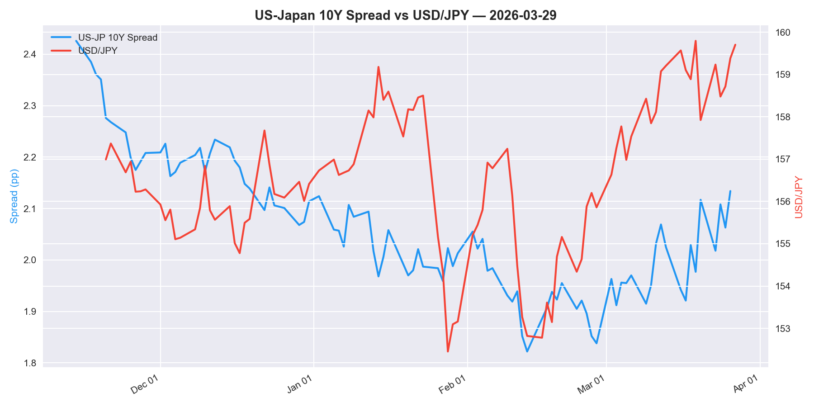
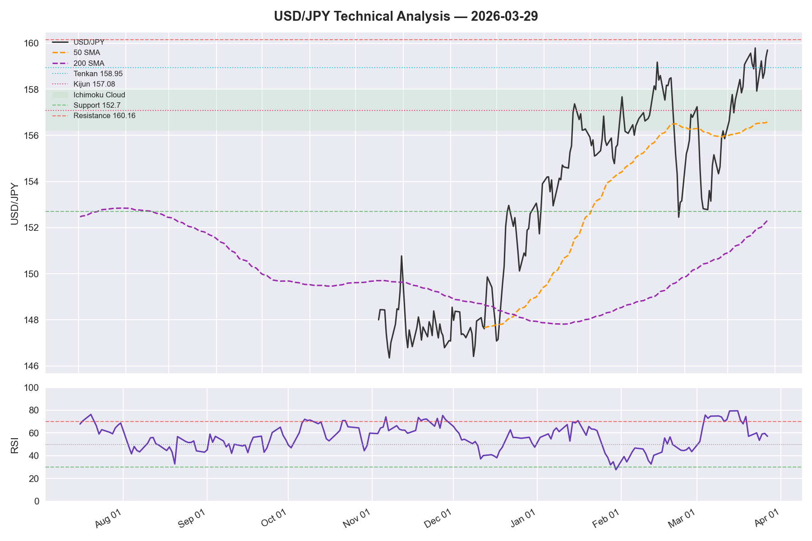
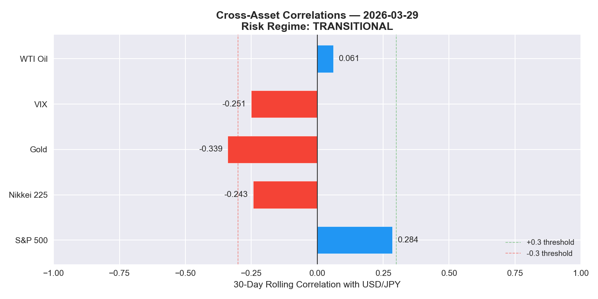

# USD/JPY Daily Analysis — 2026-03-29

> **MODERATE BULLISH** | Conviction: **HIGH** | Score: **+2/+6** | Modules: **3/6** (daily)

---

## At a Glance

| | Value | 1W | 1M | 3M | Signal |
|---|---|---|---|---|---|
| USD/JPY | 159.70 | +1.78 | +3.85 | +3.24 | — |
| US 10Y | 4.42% | +0.03 | +0.45 | +0.30 | — |
| JP 10Y | 2.29% | +0.01 | +0.15 | +0.23 | — |
| Spread | 2.13% | +0.02 | +0.30 | +0.07 | WIDENING |
| RSI (14) | 57.1 | — | — | — | NEUTRAL |

> Spread widening (CONFIRMED) with USD/JPY pressing 160.16 resistance. Ichimoku bullish with price above cloud.

---

## Risk Alerts

| Alert | Status | Detail |
|---|---|---|
| BOJ Intervention | **ELEVATED** | USD/JPY at 159.70, +3.85 yen in 30d |
| Event Risk (48h) | **UNKNOWN** | Run /usdjpy-weekly for calendar |
| COT Crowding | **N/A** | Weekly module only |
| Correlation Breakdown | **YES** | Nikkei |

---

## 01 — Macro Regime

**Bias: BULLISH** | Confidence: MEDIUM

| Metric | Current | 1W Chg | 1M Chg | 3M Chg |
|--------|---------|--------|--------|--------|
| US 10Y | 4.42% | +0.03 | +0.45 | +0.30 |
| JP 10Y | 2.29% | +0.01 | +0.15 | +0.23 |
| Spread | 2.13% | +0.02 | +0.30 | +0.07 |
| USD/JPY | 159.70 | +1.78 | +3.85 | +3.24 |

**Spread Direction:** WIDENING | **Divergence Check:** CONFIRMED

The US-Japan 10-year spread stands at 2.13pp, widening +0.30pp over the past month. Spread direction and USD/JPY are moving in concert — a confirming signal.

*JP 10Y source: MOF (daily)*

---

## 03 — Technicals

**Bias: BULLISH** | Confidence: MEDIUM

| Indicator | Value | Signal |
|-----------|-------|--------|
| Price | 159.70 | — |
| 50 SMA | 156.58 | Above price |
| 200 SMA | 152.32 | Above price |
| SMA Cross | GOLDEN | Bullish |
| RSI (14) | 57.1 | NEUTRAL |
| MACD | 0.8357 / 0.8392 | BEARISH |
| Ichimoku Cloud | ABOVE | BULLISH |

**Ichimoku:** Tenkan 158.95 | Kijun 157.08 | Cloud: GREEN (bullish)
**Key Levels:** Support 152.7 | Resistance 160.16

*Data source: Yahoo Finance (OHLCV)*

---

## 05 — Cross-Asset Correlations

**Bias: NEUTRAL** | Confidence: LOW | Regime: TRANSITIONAL

| Asset | 30d Correlation | Expected | Status |
|-------|----------------|----------|--------|
| S&P 500 | 0.284 | Positive | Normal |
| Nikkei 225 | -0.243 | Positive | BREAKDOWN |
| Gold | -0.339 | Negative | Normal |
| VIX | -0.251 | Negative | Normal |
| WTI Oil | 0.061 | Positive | Normal |

Correlations are in transition with no dominant regime; Nikkei correlation(s) inverted.

---

## 07 — Checklist

| # | Factor | Direction | Confidence | Note |
|---|--------|-----------|------------|------|
| 1 | Macro Regime | BULL | MEDIUM | Spread widening +0.30pp; CONFIRMED |
| 2 | Central Bank | N/A | N/A | Weekly module |
| 3 | Technicals | BULL | MEDIUM | GOLDEN cross; ABOVE cloud; RSI 57.1 |
| 4 | Positioning | N/A | N/A | Weekly module |
| 5 | Cross-Asset | NEUT | LOW | TRANSITIONAL; Breakdowns: Nikkei |
| 6 | Seasonality | N/A | N/A | Weekly module |

**Overall: MODERATE BULLISH**
**Score: +2 / +6** | **Conviction: HIGH** | **Modules: 3/6**

---

## Bottom Line

Rate differential widening (CONFIRMED) and bullish technical setup provide high conviction. Cross-asset regime is TRANSITIONAL — no strong cross-asset confirmation; defer to rate differential and technicals. Watch 160.16 resistance and 152.70 support. A break of 160.16 would confirm bullish momentum; a close below 152.70 would shift bias bearish.

---
*Data: FRED, MOF Japan, Yahoo Finance | TZ: JST | Next: /usdjpy-daily tomorrow | Full: /usdjpy-weekly Friday*
