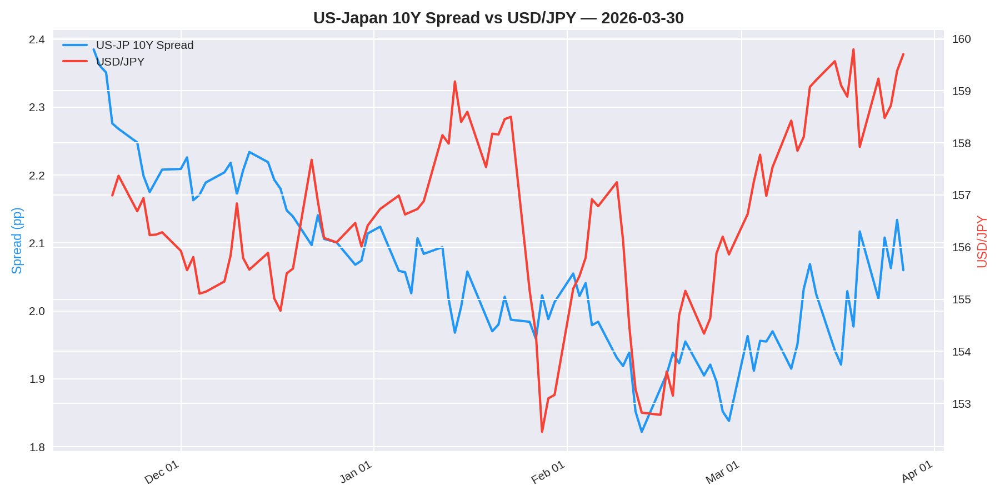
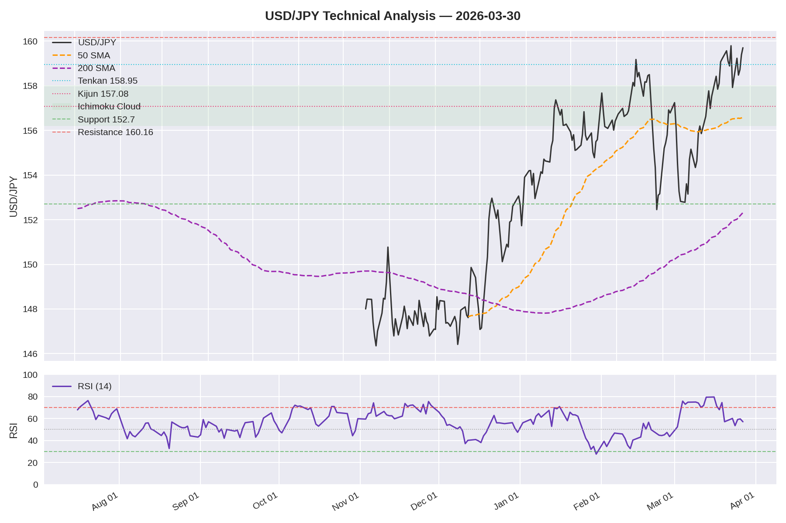
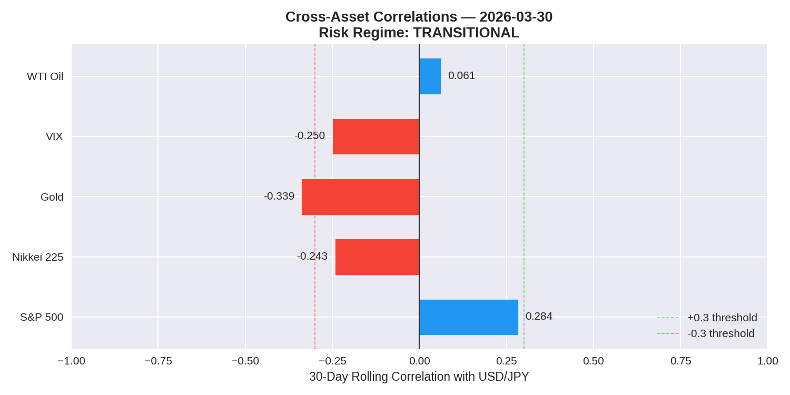

# USD/JPY Daily Analysis — 2026-03-30

> **MODERATE BULLISH** | Conviction: **LOW** | Score: **+2/+6** | Modules: **3/6** (daily)

---

## At a Glance

| | Value | 1W | 1M | 3M | Signal |
|---|---|---|---|---|---|
| USD/JPY | 159.70 | +0.47 | +3.85 | +3.69 | — |
| US 10Y | 4.44% | +0.10 | +0.47 | +0.30 | — |
| JP 10Y | 2.38% | +0.06 | +0.25 | +0.31 | — |
| Spread | 2.06% | +0.04 | +0.22 | -0.01 | WIDENING |
| RSI (14) | 57.1 | — | — | — | NEUTRAL |

> JP 10Y up 0.09pp to 2.38%; spread narrowed 0.07pp; 1W USD/JPY momentum slowed from +1.78 to +0.47. Spread widening (CONFIRMED) with USD/JPY pressing 160.16 resistance.

---

## Risk Alerts

| Alert | Status | Detail |
|---|---|---|
| BOJ Intervention | **ELEVATED** | USD/JPY at 159.70, +3.85 yen in 30d |
| Event Risk (48h) | **UNKNOWN** | Run /usdjpy-weekly for calendar |
| COT Crowding | **N/A** | Weekly module only |
| Correlation Breakdown | **YES** | Nikkei |

---

## 01 — Macro Regime

**Bias: BULLISH** | Confidence: MEDIUM

| Metric | Current | 1W Chg | 1M Chg | 3M Chg |
|--------|---------|--------|--------|--------|
| US 10Y | 4.44% | +0.10 | +0.47 | +0.30 |
| JP 10Y | 2.38% | +0.06 | +0.25 | +0.31 |
| Spread | 2.06% | +0.04 | +0.22 | -0.01 |
| USD/JPY | 159.70 | +0.47 | +3.85 | +3.69 |

**Spread Direction:** WIDENING | **Divergence Check:** CONFIRMED

The US-Japan 10-year spread stands at 2.06pp, widening +0.22pp over the past month. Since yesterday: spread narrowed 0.07pp day-over-day, JP 10Y up 0.09pp.

*JP 10Y source: MOF (daily)*

---

## 03 — Technicals

**Bias: BULLISH** | Confidence: MEDIUM

| Indicator | Value | Signal |
|-----------|-------|--------|
| Price | 159.70 | — |
| 50 SMA | 156.58 | Above price |
| 200 SMA | 152.32 | Above price |
| SMA Cross | GOLDEN | Bullish |
| RSI (14) | 57.1 | NEUTRAL |
| MACD | 0.8357 / 0.8392 | BEARISH |
| Ichimoku Cloud | ABOVE | BULLISH |

**Ichimoku:** Tenkan 158.95 | Kijun 157.08 | Cloud: GREEN (bullish)
**Key Levels:** Support 152.70 | Resistance 160.16

Technical setup unchanged: GOLDEN cross, price above cloud at 159.70, RSI neutral at 57.1. Watching 160.16 for breakout.

*Data source: Yahoo Finance (OHLCV)*

---

## 05 — Cross-Asset Correlations

**Bias: NEUTRAL** | Confidence: LOW | Regime: TRANSITIONAL

| Asset | 30d Correlation | Expected | Status |
|-------|----------------|----------|--------|
| S&P 500 | 0.284 | Positive | Normal |
| Nikkei 225 | -0.243 | Positive | BREAKDOWN |
| Gold | -0.339 | Negative | Normal |
| VIX | -0.250 | Negative | Normal |
| WTI Oil | 0.061 | Positive | Normal |

Correlations in transition with no dominant regime; Nikkei correlation(s) inverted.

---

## 07 — Checklist

| # | Factor | Direction | Confidence | Note |
|---|--------|-----------|------------|------|
| 1 | Macro Regime | BULL | MEDIUM | Spread widening +0.22pp; CONFIRMED |
| 2 | Central Bank | N/A | N/A | Weekly module |
| 3 | Technicals | BULL | MEDIUM | GOLDEN cross; ABOVE cloud; RSI 57.1 |
| 4 | Positioning | N/A | N/A | Weekly module |
| 5 | Cross-Asset | NEUT | LOW | TRANSITIONAL; Breakdowns: Nikkei |
| 6 | Seasonality | N/A | N/A | Weekly module |

**Overall: MODERATE BULLISH**
**Score: +2 / +6** | **Conviction: LOW** | **Modules: 3/6**

⚠ 3/6 modules active — conviction capped at MEDIUM — run /usdjpy-weekly for full scoring

⚠ Price at 159.70 is in deep premium (94% of range 152.7-160.16) while bias is bullish — structural conflict — conviction downgraded

---

## Bottom Line

Bias steady at MODERATE BULLISH. Rate differential widening (CONFIRMED), spread narrowed 0.07pp day-over-day. Technicals: MACD bearish, price above Ichimoku cloud. Cross-asset regime TRANSITIONAL with Nikkei breakdown(s) — defer to rate differential and technicals. Watch 160.16 resistance and 152.70 support.

---
*Data: FRED, MOF Japan, Yahoo Finance | TZ: JST | Next: /usdjpy-daily tomorrow | Full: /usdjpy-weekly Friday*
*Data freshness: FRED DCOILWTICO: 2026-03-31 08:58 | FRED DGS10: 2026-03-31 08:57 | FRED SP500: 2026-03-31 08:58 | FRED VIXCLS: 2026-03-31 08:58 | MOF JGB: 2026-03-31 08:58 | YF GC=F: 2026-03-31 08:58 | YF USDJPY=X: 2026-03-31 08:57 | YF ^N225: 2026-03-31 08:58*
