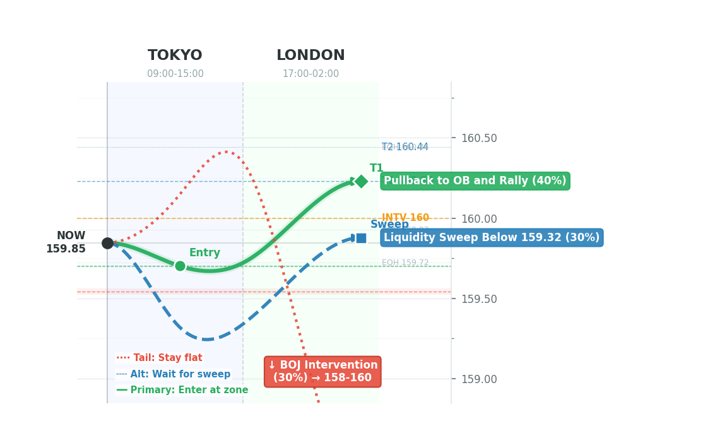
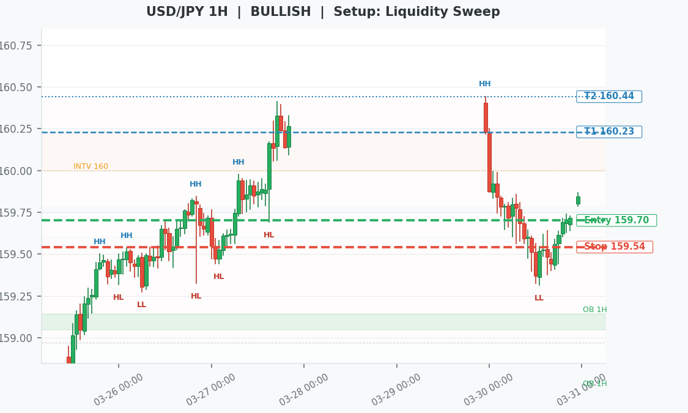

# USD/JPY Smart Money Concepts — 2026-03-31

## 08 — Smart Money Concepts

### Context (from Module 07)

**Direction:** LONG
**Confidence:** LOW
**Report Date:** 2026-03-30

**Risk Alerts:**
- | BOJ Intervention: ELEVATED — USD/JPY at 159.70, +3.85 yen in 30d
- Event Risk (48h): UNKNOWN — Run /usdjpy-weekly for calendar
- | Correlation Breakdown: YES — Nikkei

**Recommendation:** 

---

### 4H Structure

**Market Structure:** BULLISH
**Last BOS/ChoCH:** ChoCH (bullish) at 160.44 on 2026-03-29 20:00:00+00:00
**Premium/Discount:** Price at 159.85 is in **DEEP PREMIUM** (strong short zone)
**Range:** 157.50 — 160.44 (midpoint: 158.97)
**OTE Zone:** 159.32 — 159.81 (61.8%-79%)

**MTF Alignment:**
| Timeframe | Structure |
|-----------|-----------|
| 4H | BULLISH |
| 1H | BULLISH |
| 15M | BEARISH |
| 5M | BULLISH |

---

### Setup Classification

**Setup Type:** Liquidity Sweep
**Rationale:** Price swept above EQH at 159.72 — buy stops taken. Watch for reversal to trap longs.
**Bias Alignment:** No — reduced probability

---

### Entry Zone (1H)

**Zone Type:** Order Block | **INTERVENTION OB**
**Zone Range:** 159.70 — 159.70
**Full Range:** 159.64 — 159.74
**Timeframe:** 5M
**Distance from Current Price:** 15 pips
**Status:** Unmitigated

---

### Confirmation Status (15M)

**Status:** CONFIRMED
**Detail:** 15M bullish engulfing at zone

---

### Entry Plan

| Field | Value | Notes |
|-------|-------|-------|
| Direction | LONG | |
| Entry | 159.70 | Zone top |
| Stop Loss | 159.54 | 16 pips risk |
| Target 1 | 160.23 (PDH / PWH) | R:R = 1:3.3 |
| Target 2 | 160.44 (EQH) | R:R = 1:4.7 |

**Confluence Score:** 1.5 — Grade **C**

**Scoring Details:**
- +1 Order block at entry zone
- +1 Liquidity swept before reversal
- +0.5 Round number alignment
- -1 Event risk within 4 hours

---

### Next 12h Playbook

> Generated at 08:58 JST — sessions: Tokyo + London

#### Primary: Pullback to OB and Rally (40%)
- **Tokyo:** Price drifts lower from 159.85 toward 159.70-159.70 Order Block.
- **London:** If 15M confirms bullish at the zone, enter long targeting 160.23. Key session for the move.
- **Key Level:** 159.70 | **Trigger:** 15M bullish engulfing or ChoCH at 159.70-159.70 Order Block
- **Action:** Enter long at 159.70, stop 159.54, target 160.23
- **Invalidation:** Price breaks below 159.54

#### Alternative: Liquidity Sweep Below 159.32 (30%)
- **Tokyo:** Price drops through entry zone, sweeps 159.32 sell-stop liquidity.
- **London:** If displacement candle after sweep, deeper entry with better R:R from lower zone.
- **Key Level:** 159.32 | **Trigger:** Sweep of 159.32 + bullish displacement on 5M
- **Action:** Wait for sweep, enter at 159.37, stop 159.12, target 159.93
- **Invalidation:** Price holds below 159.02 after sweep

#### Tail Risk: BOJ Intervention (30%)
- **Tokyo:** MOF verbal escalation or rate check near 160.
- **London:** Full intervention — USD/JPY drops 200-400 pips in minutes.
- **Key Level:** 160.00 (intervention) | **Trigger:** MOF headline, Reuters/Bloomberg flash
- **Action:** Stay flat. Do not catch the falling knife. Wait for structure to rebuild.
- **Invalidation:** N/A — event-driven

---
### Active Zones Summary

| Timeframe | Type | Zone | Direction | Status |
|-----------|------|------|-----------|--------|
| 4H | Bullish Ob | 153.08-153.18 | Long | Unmitigated |
| 4H | Bullish Ob (INTERVENTION) | 154.42-154.91 | Long | Unmitigated |
| 4H | Bullish Fvg | 152.84-152.98 | Long | Unfilled |
| 4H | Bullish Fvg | 153.34-153.38 | Long | Unfilled |
| 4H | Bullish Fvg | 153.86-154.23 | Long | Unfilled |
| 4H | Bullish Fvg | 154.77-154.94 | Long | Unfilled |
| 4H | Bullish Fvg | 155.14-155.67 | Long | Unfilled |
| 4H | Bullish Fvg | 156.14-156.15 | Long | Unfilled |
| 4H | Bullish Fvg | 156.19-156.28 | Long | Unfilled |
| 4H | Bullish Fvg | 157.99-158.27 | Long | Unfilled |
| 4H | Bullish Fvg | 159.25-159.32 | Long | Unfilled |
| 4H | Bearish Fvg | 159.86-160.22 | Short | Unfilled |
| 1H | Bullish Ob | 152.54-152.85 | Long | Unmitigated |
| 1H | Bullish Ob | 153.06-153.12 | Long | Unmitigated |
| 1H | Bullish Ob (INTERVENTION) | 154.96-155.16 | Long | Unmitigated |
| 1H | Bullish Ob | 155.58-155.73 | Long | Unmitigated |
| 1H | Bullish Ob | 158.64-158.70 | Long | Unmitigated |
| 1H | Bullish Ob | 159.05-159.14 | Long | Unmitigated |
| 1H | Bullish Fvg | 153.30-153.43 | Long | Unfilled |
| 1H | Bullish Fvg | 153.53-153.57 | Long | Unfilled |
| 1H | Bullish Fvg | 153.80-153.91 | Long | Unfilled |
| 1H | Bullish Fvg | 154.41-154.47 | Long | Unfilled |
| 1H | Bullish Fvg | 154.70-154.84 | Long | Unfilled |
| 1H | Bullish Fvg | 155.83-155.87 | Long | Unfilled |
| 1H | Bullish Fvg | 156.04-156.20 | Long | Unfilled |
| 1H | Bullish Fvg | 156.34-156.51 | Long | Unfilled |
| 1H | Bullish Fvg | 156.77-156.88 | Long | Unfilled |
| 1H | Bullish Fvg | 156.96-156.98 | Long | Unfilled |
| 1H | Bullish Fvg | 157.98-158.10 | Long | Unfilled |
| 1H | Bullish Fvg | 158.41-158.43 | Long | Unfilled |
| 1H | Bearish Fvg | 160.00-160.22 | Short | Unfilled |
| 1H | Bullish Fvg | 159.59-159.60 | Long | Unfilled |
| 1H | Bullish Fvg | 159.74-159.79 | Long | Unfilled |
| 15M | Bullish Ob | 153.00-153.01 | Long | Unmitigated |
| 15M | Bullish Ob | 153.61-153.65 | Long | Unmitigated |
| 15M | Bullish Ob (INTERVENTION) | 154.72-154.75 | Long | Unmitigated |
| 15M | Bullish Ob (INTERVENTION) | 154.91-154.98 | Long | Unmitigated |
| 15M | Bullish Ob (INTERVENTION) | 154.96-155.05 | Long | Unmitigated |
| 15M | Bullish Ob | 155.47-155.55 | Long | Unmitigated |
| 15M | Bullish Ob | 156.02-156.17 | Long | Unmitigated |
| 15M | Bullish Ob | 158.30-158.33 | Long | Unmitigated |
| 15M | Bullish Ob | 159.02-159.03 | Long | Unmitigated |
| 15M | Bullish Ob | 159.09-159.11 | Long | Unmitigated |
| 15M | Bullish Ob | 159.18-159.21 | Long | Unmitigated |
| 15M | Bullish Ob | 159.30-159.44 | Long | Unmitigated |
| 15M | Bullish Fvg | 153.26-153.33 | Long | Unfilled |
| 15M | Bullish Fvg | 153.35-153.35 | Long | Unfilled |
| 15M | Bullish Fvg | 153.48-153.53 | Long | Unfilled |
| 15M | Bullish Fvg | 153.55-153.56 | Long | Unfilled |
| 15M | Bullish Fvg | 153.76-153.78 | Long | Unfilled |
| 15M | Bullish Fvg | 153.88-153.91 | Long | Unfilled |
| 15M | Bullish Fvg | 153.95-153.96 | Long | Unfilled |
| 15M | Bullish Fvg | 154.20-154.21 | Long | Unfilled |
| 15M | Bullish Fvg | 154.34-154.35 | Long | Unfilled |
| 15M | Bullish Fvg | 154.41-154.47 | Long | Unfilled |
| 15M | Bullish Fvg | 154.68-154.70 | Long | Unfilled |
| 15M | Bullish Fvg | 154.78-154.84 | Long | Unfilled |
| 15M | Bullish Fvg | 154.87-154.92 | Long | Unfilled |
| 15M | Bullish Fvg | 155.07-155.64 | Long | Unfilled |
| 15M | Bullish Fvg | 155.61-155.66 | Long | Unfilled |
| 15M | Bullish Fvg | 155.70-155.76 | Long | Unfilled |
| 15M | Bullish Fvg | 156.04-156.32 | Long | Unfilled |
| 15M | Bullish Fvg | 156.38-156.40 | Long | Unfilled |
| 15M | Bullish Fvg | 156.68-156.73 | Long | Unfilled |
| 15M | Bullish Fvg | 156.79-156.83 | Long | Unfilled |
| 15M | Bullish Fvg | 157.05-157.12 | Long | Unfilled |
| 15M | Bullish Fvg | 157.20-157.25 | Long | Unfilled |
| 15M | Bullish Fvg | 157.50-157.59 | Long | Unfilled |
| 15M | Bullish Fvg | 157.88-158.02 | Long | Unfilled |
| 15M | Bullish Fvg | 158.03-158.10 | Long | Unfilled |
| 15M | Bullish Fvg | 158.14-158.15 | Long | Unfilled |
| 15M | Bullish Fvg | 158.19-158.26 | Long | Unfilled |
| 15M | Bullish Fvg | 158.28-158.30 | Long | Unfilled |
| 15M | Bullish Fvg | 158.40-158.44 | Long | Unfilled |
| 15M | Bullish Fvg | 158.85-158.94 | Long | Unfilled |
| 15M | Bullish Fvg | 159.23-159.23 | Long | Unfilled |
| 15M | Bearish Fvg | 160.25-160.31 | Short | Unfilled |
| 15M | Bearish Fvg | 160.14-160.22 | Short | Unfilled |
| 15M | Bearish Fvg | 160.02-160.04 | Short | Unfilled |
| 15M | Bearish Fvg | 159.91-159.91 | Short | Unfilled |
| 15M | Bearish Fvg | 159.85-159.89 | Short | Unfilled |
| 15M | Bullish Fvg | 159.46-159.51 | Long | Unfilled |
| 15M | Bullish Fvg | 159.54-159.56 | Long | Unfilled |
| 15M | Bullish Fvg | 159.64-159.65 | Long | Unfilled |
| 15M | Bullish Fvg | 159.74-159.79 | Long | Unfilled |
| 15M | Bullish Fvg | 159.73-159.79 | Long | Unfilled |
| 5M | Bullish Ob | 158.37-158.38 | Long | Unmitigated |
| 5M | Bullish Ob | 159.02-159.04 | Long | Unmitigated |
| 5M | Bullish Ob | 159.14-159.20 | Long | Unmitigated |
| 5M | Bullish Ob | 159.26-159.26 | Long | Unmitigated |
| 5M | Bullish Ob | 159.35-159.36 | Long | Unmitigated |
| 5M | Bearish Ob (INTERVENTION) | 159.92-159.97 | Short | Unmitigated |
| 5M | Bullish Ob (INTERVENTION) | 159.57-159.57 | Long | Unmitigated |
| 5M | Bullish Ob (INTERVENTION) | 159.70-159.70 | Long | Unmitigated |
| 5M | Bullish Fvg | 158.11-158.13 | Long | Unfilled |
| 5M | Bullish Fvg | 158.22-158.26 | Long | Unfilled |
| 5M | Bullish Fvg | 158.28-158.29 | Long | Unfilled |
| 5M | Bullish Fvg | 158.40-158.46 | Long | Unfilled |
| 5M | Bullish Fvg | 158.58-158.62 | Long | Unfilled |
| 5M | Bullish Fvg | 158.83-158.91 | Long | Unfilled |
| 5M | Bullish Fvg | 158.98-158.99 | Long | Unfilled |
| 5M | Bullish Fvg | 159.09-159.10 | Long | Unfilled |
| 5M | Bearish Fvg | 160.38-160.39 | Short | Unfilled |
| 5M | Bearish Fvg | 160.32-160.35 | Short | Unfilled |
| 5M | Bearish Fvg | 160.25-160.26 | Short | Unfilled |
| 5M | Bearish Fvg | 160.17-160.22 | Short | Unfilled |
| 5M | Bearish Fvg | 160.13-160.16 | Short | Unfilled |
| 5M | Bearish Fvg | 160.04-160.06 | Short | Unfilled |
| 5M | Bearish Fvg | 159.90-159.94 | Short | Unfilled |
| 5M | Bearish Fvg | 159.85-159.86 | Short | Unfilled |
| 5M | Bullish Fvg | 159.39-159.39 | Long | Unfilled |
| 5M | Bullish Fvg | 159.49-159.49 | Long | Unfilled |
| 5M | Bullish Fvg | 159.59-159.60 | Long | Unfilled |
| 5M | Bullish Fvg | 159.74-159.79 | Long | Unfilled |
| 5M | Bullish Fvg | 159.73-159.82 | Long | Unfilled |
| 5M | Bullish Fvg | 159.83-159.83 | Long | Unfilled |

---

### Key Liquidity Levels

| Level | Type | Significance |
|-------|------|-------------|
| 161.95 | INTERVENTION | BOJ intervention level (161.95) |
| 161.00 | ROUND | Round number 161.00 |
| 160.44 | EQH | Buy stops — 2 touches |
| 160.23 | PDH / PWH | Previous day high |
| 160.23 | PWH | Previous week high |
| 160.00 | INTERVENTION | BOJ intervention level (160.00) |
| 160.00 | ROUND | Round number 160.00 |
| 159.93 | EQH | Buy stops — 3 touches |
| 159.88 | TOKYO_FIX | Today's Tokyo fix (9:55 JST) |
| 159.72 | EQH | Buy stops — 6 touches |
| 159.48 | EQH | Buy stops — 7 touches |
| 159.32 | PDL | Previous day low |
| 159.29 | EQL | Sell stops — 6 touches |
| 159.20 | EQH | Buy stops — 7 touches |
| 159.00 | EQL | Sell stops — 3 touches |

---

### Session Plan

**Primary Session:** LONDON/NY (highest liquidity for trend continuation)
**Tokyo fix: 159.88**

**Tokyo (09:00-15:00 JST):** Monitor for range definition and fix flows
**London (17:00-02:00 JST):** Key session for trend moves — watch for BOS on 15M
**New York (22:00-07:00 JST):** Continuation or reversal — watch US data releases

---

### Invalidation Criteria

- Price breaks below 159.54 (stop level)
- 4H structure flips to BEARISH (new LL)
- Major unexpected news event changes macro backdrop

---

---
*Generated: 2026-03-31 08:58 JST*
*Source: Module 07 from 2026-03-30*