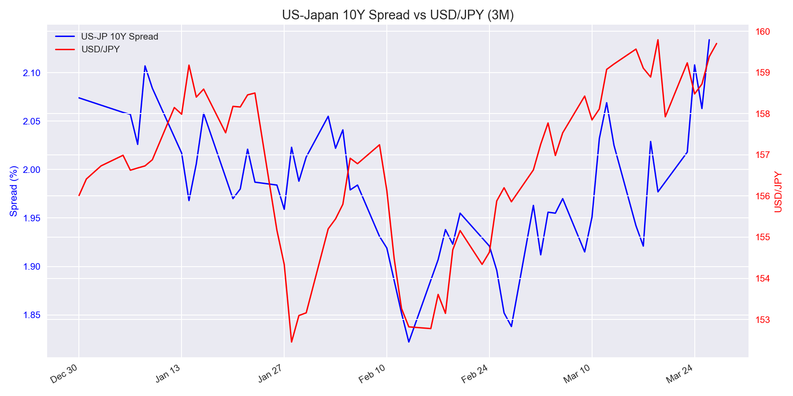
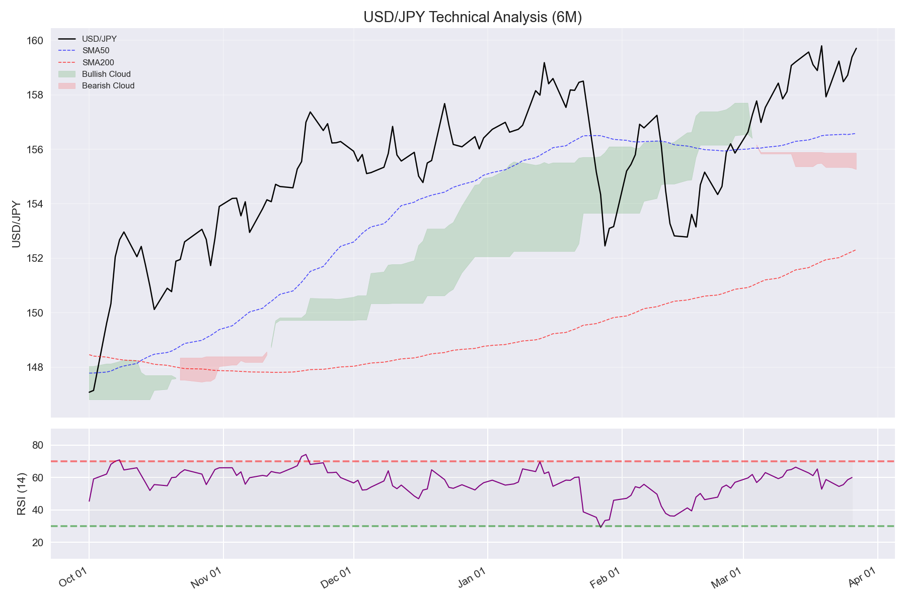
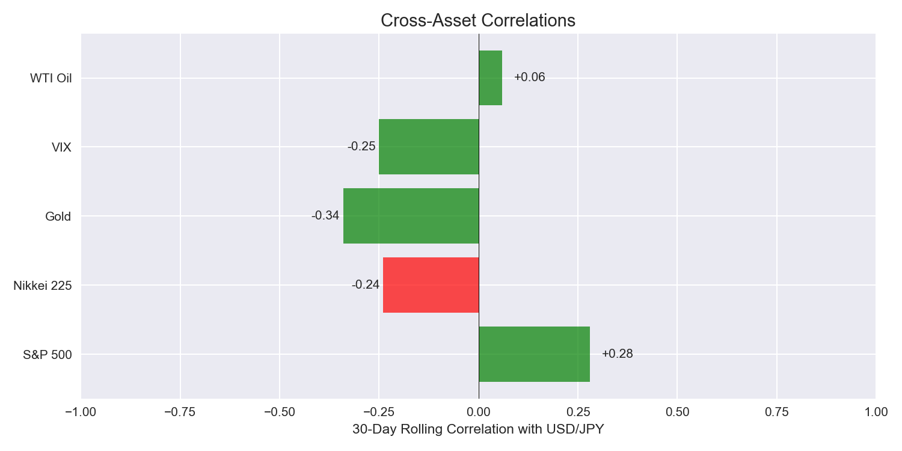

# USD/JPY Weekly Analysis — Week of 2026-03-30

> **NEUTRAL** | Conviction: **LOW** | Score: **+1/+12** | Full coverage: **6/6 modules**

---

## At a Glance

| | Value | 1W | 1M | 3M | Signal |
|---|---|---|---|---|---|
| USD/JPY | 159.70 | +2.44 | +4.86 | +8.11 | — |
| US 10Y | 4.42% | +0.14 | +0.23 | +0.14 | — |
| JP 10Y | 2.38% | +0.10 | +0.13 | +1.27 | — |
| Spread | 2.04% | +0.04 | +0.17 | — | WIDENING |
| RSI (14) | 57.1 | — | — | — | NEUTRAL |
| COT Net | -62,806 | +4,974 | — | — | CROWDED |

> USD/JPY surged to 159.70 this week (+2.44), driven by broad USD strength (DXY back above 100) and a critical energy shock (WTI +33% 1M) that structurally weakens the yen. The tug-of-war intensifies: widening spreads and technicals favor upside, but record speculative short-JPY positioning, MOF intervention rhetoric, and fiscal year-end repatriation flows cap gains near 160.

---

## Risk Alerts

| Alert | Status | Detail |
|---|---|---|
| BOJ Intervention | **ELEVATED** | USD/JPY at 159.70, +4.86 yen in 30d; FM Katayama warned "bold steps" Mar 27 |
| Event Risk (next week) | **YES** | Tankan Q1 (Tue), US ISM Mfg (Wed), US NFP (Fri), Good Friday liquidity thin |
| COT Crowding | **YES** | 0th percentile — extreme net short JPY (-62,806 contracts) |
| Correlation Breakdown | **YES** | Nikkei 225 correlation flipped negative |
| Seasonal Flow | **YES** | Japan fiscal year-end Mar 31 — repatriation flows may support JPY |

---

## 01 — Macro Regime

**Bias: BULLISH** | Confidence: M

| Metric | Current | 1W Chg | 1M Chg | 3M Chg |
|--------|---------|--------|--------|--------|
| US 10Y | 4.42% | +0.14 | +0.23 | +0.14 |
| JP 10Y | 2.38% | +0.10 | +0.13 | +1.27 |
| Spread | 2.04% | +0.04 | +0.17 | — |
| USD/JPY | 159.70 | +2.44 | +4.86 | +8.11 |
| JGB 2s10s | 0.99% | -0.01 | Flattening |
| JGB 2s30s | 2.24% | +0.02 | Steepening |
| DXY | 100.09 | +0.44 | +2.48 | USD-driven |

**Spread Direction:** WIDENING
**Divergence Check:** CONFIRMED

The US-Japan 10Y spread widened to 2.04% as US yields rose faster than JGB yields. The carry trade narrative remains intact with the spread trending wider on a 1-month basis (+0.17pp). USD/JPY movement is confirmed by spread direction — no divergence.

JGB 2s10s is flattening marginally (-1bp) while 2s30s steepened 2bps this week. The super-long end is under modest pressure but not yet triggering fiscal dominance alarms.

The current move is **USD-driven**: DXY back above 100 (+2.48 1M) confirms broad dollar strength rather than JPY-specific weakness.

### Market Context
**Driver:** USD-driven
**DXY:** 100.09 (+0.44 1W)
**JGB Curve:** 2s10s 0.99% (flattening) | 2s30s 2.24% (steepening)

---

## 02 — Policy & Politics

**Bias: NEUTRAL** | Confidence: L

### BOJ
| Field | Status |
|-------|--------|
| Policy Rate | 0.75% |
| Stance | Holding |
| Last Meeting | 2026-03-19 — Held at 0.75% (8-1 vote; Takata dissented for hike) |
| Next Meeting | 2026-04-28 (29d) |
| Key Quote | New risk scenario from Middle East oil prices — maintaining status quo |

### Fed
| Field | Status |
|-------|--------|
| Fed Funds Rate | 3.50%-3.75% |
| Stance | Holding |
| Last Meeting | 2026-03-18 — Held at 3.50-3.75%; dot plot: 1 cut in 2026 |
| Next Meeting | 2026-04-29 (30d) |
| Key Quote | Uncertainty about economic outlook remains elevated |

### Intervention Risk
**MOF Rhetoric Level:** STRONG WARNING
**Last Intervention:** Jul 2024 (~¥161)

### Japanese Political Developments
**Political Risk:** MEDIUM
**Key Development:** Diet debating record ¥122 trillion FY2026 budget; PM Takaichi signaling fiscal reform by eliminating routine supplementary budgets, but stopgap budget prepared if FY2026 bill slips past March. Budget will auto-enact by Apr 12 under constitutional rules.

Both central banks are holding — policy divergence is stable. BOJ expected to resume hiking (Takata dissented for 1.0%), and the oil price shock adds urgency to pause. Fed dot plot shows 1 cut possible in 2026 — gradual spread narrowing bias, but no imminent catalyst. Intervention risk is ELEVATED after FM Katayama flagged "bold steps" on Mar 27 as yen neared 160. Political risk is MEDIUM — the record budget size and ongoing Diet debate create fiscal uncertainty, though Takaichi's pledge to end supplementary budget reliance is a fiscal discipline signal.

---

## 03 — Technicals

**Bias: BULLISH** | Confidence: M

| Indicator | Value | Signal |
|-----------|-------|--------|
| Price vs SMA50 | Above (156.58) | Bullish |
| Price vs SMA200 | Above (152.32) | Bullish |
| SMA50 vs SMA200 | Golden Cross | Bullish |
| RSI (14) | 57.1 | Neutral |
| MACD | Above signal | Bullish |
| Ichimoku Cloud | Above cloud | Bullish |

**Key Levels:** Support 152.70 / Resistance 160.16

Price is well above both SMAs with a golden cross intact and Ichimoku fully bullish. RSI at 57 has room to run — not overbought. The 160.00-160.50 zone is the key near-term resistance; a daily close above 160.50 opens the 162.00 target. On the downside, the SMA50 at 156.58 is first meaningful support.

---

## 04 — Positioning (COT)

**Bias: BEARISH** | Confidence: H | *(contrarian interpretation)*

| Metric | Value |
|--------|-------|
| Net Speculative Position | -62,806 contracts (short JPY) |
| Week-over-Week Change | +4,974 contracts |
| 3-Year Percentile | 0th (first data point) |
| Crowding Status | CROWDED |

Speculators are heavily net short JPY at -62,806 contracts — an extreme reading that flags reversal risk. The +4,974 contract addition this week shows shorts are still piling in. This is a **strong contrarian signal**: when positioning is this crowded, a catalyst (intervention, risk-off event, Tankan surprise) could trigger a violent short squeeze, pushing USD/JPY sharply lower.

### Institutional Flow Context
**Flow Notes:** March fiscal year-end is driving the Japan passive dividend reinvestment and rebalancing trade. GPIF portfolio shift speculation persists — potential increased allocation to JGBs at the expense of foreign bonds (USD-negative). Japanese life insurers have hedging ratios near 13-year lows, leaving significant unhedged foreign asset exposure. Carry trade profitability is diminishing as JGB yields rise and hedging costs remain elevated. Multiple banks flagging "carry trade unwind" as a major 2026 theme.

---

## 05 — Cross-Asset Correlations

**Bias: NEUTRAL** | Confidence: L

| Asset | 30d Correlation | Expected | Status |
|-------|----------------|----------|--------|
| S&P 500 | +0.28 | Positive | Normal |
| Nikkei 225 | -0.24 | Positive | **Breakdown** |
| Gold | -0.34 | Negative | Normal |
| VIX | -0.25 | Negative | Normal |
| WTI Oil | +0.06 | Positive | Normal |

**Energy Risk: CRITICAL** — WTI at $89.33 (+33.4% 1M)

**Risk Regime:** TRANSITIONAL
**Breakdown Alerts:** Nikkei 225 correlation has flipped negative

The Nikkei correlation breakdown suggests Japanese equities are pricing in the oil cost shock (import-heavy economy) rather than following the traditional weak-yen-boosts-exporters playbook. The **critical energy risk** is the week's biggest macro development: WTI surging 33% in one month will blow out Japan's trade deficit and structurally weaken the yen. Japan imports ~90% of its crude oil — every $10/bbl adds roughly ¥2 trillion to the annual import bill.

---

## 06 — Seasonality & Flows

**Bias: BEARISH** | Confidence: M

| Factor | Status |
|--------|--------|
| Current Month | March — Historical bias: JPY strength (Strong) |
| Fiscal Year Position | 1 day until Japan FY-end (Mar 31) |
| Repatriation Flow | **Active** — peak period |

### Upcoming Events (next 2 weeks)
| Date | Event | Expected Impact |
|------|-------|-----------------|
| Mar 31 | Japan Fiscal Year-End | JPY supportive (repatriation) |
| Mar 31 | Tankan Q1 Survey | High volatility — BOJ policy signal |
| Apr 1 | New Fiscal Year begins | JPY weakness bias (new overseas allocations) |
| Apr 3 | Good Friday — EU/US closed | Thin liquidity, watch for gaps |
| Apr 4 | US NFP (March) | High impact |

March is historically the strongest JPY month due to fiscal year-end repatriation. This effect typically fades by the first week of April when new overseas investment allocations begin.

### Trade Balance
**Trade Balance:** surplus — ¥57.3 billion (February 2026)
**Current Account:** surplus — ¥942.6 billion (January 2026)
**Trend:** Deteriorating — February trade surplus plunged from ¥559.2B year-ago to ¥57.3B as imports surged on higher energy costs. The oil price shock will likely push March/April into outright deficit territory, removing structural JPY support.

---

## 07 — Checklist

| # | Factor | Direction | Confidence | Note |
|---|--------|-----------|------------|------|
| 1 | Macro Regime | BULL | M | Spread widening +0.17 1M, confirmed by price |
| 2 | Policy & Politics | NEUT | L | Both holding, divergence stable, political risk MEDIUM |
| 3 | Technicals | BULL | M | Golden cross, above cloud, RSI 57 neutral |
| 4 | Positioning | BEAR | H | Crowded short JPY (-62.8K), contrarian reversal risk |
| 5 | Cross-Asset | NEUT | L | Transitional, Nikkei breakdown, energy CRITICAL |
| 6 | Seasonality | BEAR | M | March FY-end repatriation + trade balance deteriorating |

**Overall: NEUTRAL**
**Score: +1 / +12** | **Conviction: LOW** | **Modules: 6/6**

---

## Week Ahead

The macro and technical picture favor USD/JPY upside (spread widening, golden cross, above cloud), but three forces are holding the pair below 160: (1) extreme speculative short-JPY positioning creates violent reversal risk, (2) fiscal year-end repatriation flows peak on Mar 31, and (3) MOF rhetoric has escalated to "strong warning" territory near 160. **Key levels:** a daily close above 160.50 would signal breakout toward 162; a break below 158.50 confirms the repatriation/squeeze narrative. **Events to watch:** Tankan Q1 on Tuesday is the week's biggest catalyst — an upside surprise (>17) would strengthen BOJ hiking expectations and trigger yen buying. US NFP on Friday and ISM Manufacturing on Wednesday will test the USD side of the equation. Good Friday thins liquidity, raising gap risk into the weekend. The energy shock (WTI at $89) is the wildcard — if oil breaks $90, the trade deficit narrative accelerates yen weakness despite all the bearish signals.

---

## vs Last Week

First weekly report with upgraded format — no prior week comparison available.

---

*Data: FRED, MOF Japan, Yahoo Finance, CFTC | TZ: JST | Next: /usdjpy-weekly Friday*
